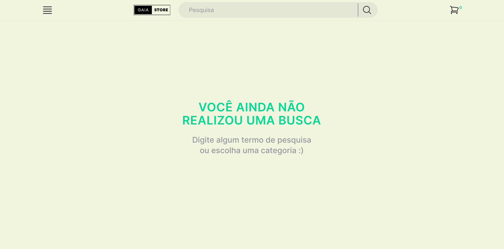

<div align="center">
  
</div>

# 🏪 Gaia Online Store

### 📘 Sobre
Criei esta loja online 100% responsiva utilizando os conceitos aprendidos no módulo de Front-end, na escola de tecnologia [Trybe](https://www.betrybe.com/) , e para praticar novas tecnologias como Next.js e Tailwind.css;

### 🛠️ Funcionalidades
  - [x] Busca de produtos com API do Mercado Livre;
  - [x] Barra de pesquisa superior por nome;
  - [x] Barra de pesquisa lateral por categorias;
  - [x] Tela de detalhes do produto;
  - [x] Tela de Carrinho de compras;
  - [x] Tela de Checkout;

### ⚛️ Tecnologias


### 📝 Pré-requisitos

Antes de começar, você vai precisar ter instalado em sua máquina as seguintes ferramentas:
[Git](https://git-scm.com), [Node.js](https://nodejs.org/en/). 
Além disto é bom ter um editor para trabalhar com o código como [VSCode](https://code.visualstudio.com/);

### 🎲 Rodando localmente

```bash
# Clone este repositório
$ git clone git@github.com:vitorGaia/online-store.git

# Instale as dependências
$ npm install

# Execute a aplicação em modo de desenvolvimento
$ npm run dev
```

### 🚀 Deploy da aplicação
Neste [Link](https://gaia-online-store.vercel.app/) você pode ver meu projeto em ação.

<div align="center">
  
</div>